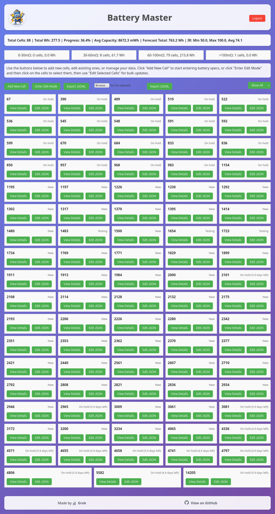
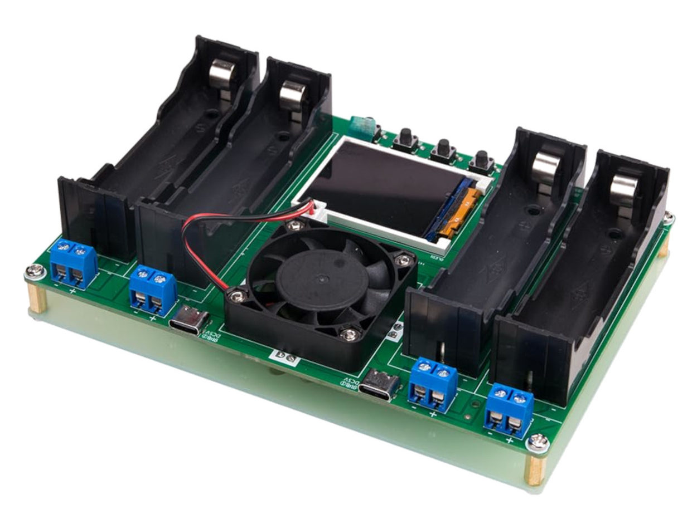

# Battery Master

This is a web application for managing and tracking lithium-ion cell specifications through various testing stages. 

It is designed to assist in the sorting and organising of battery packs built from recycled cells where the individual cell characteristics are varied. 

It facilitates the efficient collecting of cell data including voltage, internal resistance, capacity, and testing dates.

## Why did I make it?

I am building a new lithium battery pack for my e-scooter and I am using second-hand lithium cells. Reclaimed cells offer excellent value for money but they also vary a bit from one to the next because every cell ages in its own unique way.

When building battery packs with second-hand cells, it is important to combine the cells carefully to ensure the best reliability and longevity of the battery pack.  

I am using a battery cell tester like this one:

It takes a few days to test a large number of cells and requires careful record-keeping. It is a bit cumbersome to use a spreadsheet on a mobile device, so I made this app to assist in the collecting of the data and for the calculating of the overall pack statistics.

## Testing procedure and Data Stages

Each cell is already numbered with a unique id. I first test the voltage and internal resistance. These are entered into the form when I click the "Add new" button.

I then charge each cell to full capacity and I click to edit the cell, and I record the voltage of the cell after it has been charged.

I then set the test mode to discharge and I let it run the battery down until it reaches the cutoff voltage. I then click to edit the cell details again and I record: milliamps capacity, milliwatts capacity and the cell voltage at rest after having been fully discharged.

I then recharge the cell to full and again edit the cell to record the voltage after recharge. 

I then let the cell rest for 7 days before recording the voltage and Internal Resistance again. This can help to identify faulty cells that would eventually destroy a battery pack.

Those are the five stages of testing and they are labeled as such:

1. **New**: Initial entry (cell number, voltage, IR)
2. **Testing**: First charge voltage entered
3. **Charging**: Capacity data (mAh, mWh, flat voltage) entered
4. **On hold**: Recharge voltage entered
5. **Tested**: 7-day voltage and IR entered

## Features

- **Multi-stage Cell Entry**: Enter cell data through sequential stages (initial specs, charge voltage, capacity, recharge, 7-day testing)
- **Bulk Data Entry**: Quick entry of multiple cells with "Save and Next" functionality
- **Flexible Editing**: Edit individual cells through stages or use bulk edit mode for multiple cells
- **Data Persistence**: All data saved as JSON files on the server
- **Authentication**: Cookie-based login for security
- **Export/Import**: Export all data to JSONL format, import to merge data
- **Filtering**: Filter cells by testing stage
- **Status Tracking**: Automatic status updates based on completion stage

## Prerequisites

- Docker and Docker Compose
- Web browser

## Installation

1. Clone or download this repository
2. Navigate to the `cell-app` directory
3. Copy `.env.example` to `.env` and set your password: `PASSWORD=yourpassword`
4. Run `docker-compose up --build`

The app will be available at `http://localhost:3000`

## First Time Setup

1. Open `http://localhost:3000` in your browser
2. You'll be redirected to the login page
3. Enter the password you have defined in .env
4. Click "Login"

## Usage

### Adding New Cells

1. Click "Add New Cell"
2. Enter cell number, first voltage, and internal resistance
3. Click "Save and Next" to add another cell, or "Save" to finish

### Editing Cells

#### Individual Edit
- Click on any cell in the list to open the edit form
- Navigate through stages using "Save" (next stage) or "Save and Next" (next cell)

#### Bulk Edit
1. Click "Enter Edit Mode"
2. Check the boxes next to cells you want to edit
3. Click "Edit Selected Cells"
4. Edit through stages; "Save and Next" moves to the next selected cell

### Viewing Details

- Click "View Details" on any cell to see all specifications
- Use the stage filter dropdown to show only cells in specific stages

### Exporting Data

- Click "Export JSONL" to download all cell data in JSON Lines format

### Importing Data

1. Click "Choose File" next to "Import JSONL"
2. Select a .jsonl file
3. Click "Import JSONL"
4. Data will be merged with existing cells

### Direct JSON Editing

- Click "Edit JSON" on any cell for direct JSON editing (for corrections)

## File Structure

- `data/`: JSON files for each cell
- `public/`: Web assets (HTML, CSS, JS)
- `server.js`: Node.js Express server
- `Dockerfile`: Docker container configuration

## Troubleshooting

- If login fails, ensure you're using the correct password
- For import/export issues, check browser console for errors
- Data is persisted in the `data` directory within the Docker container

## Security

- Uses cookie-based authentication
- All data stored locally in JSON files
- No external data transmission

## Support

No support is offered for this product. You can modify your own copy of it or get someone else to do it for you. 

## License

This project is licensed under the GNU General Public License v3.0 - see the [LICENSE](LICENSE) file for details.

## Support

In case of problems, check the application logs or examine the JSON files in the data directory.
